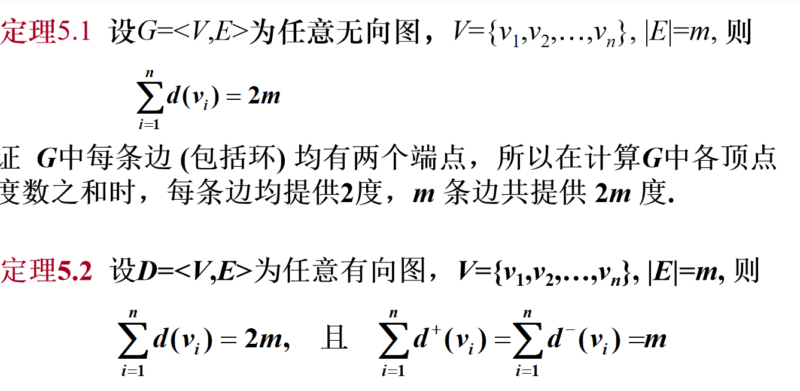
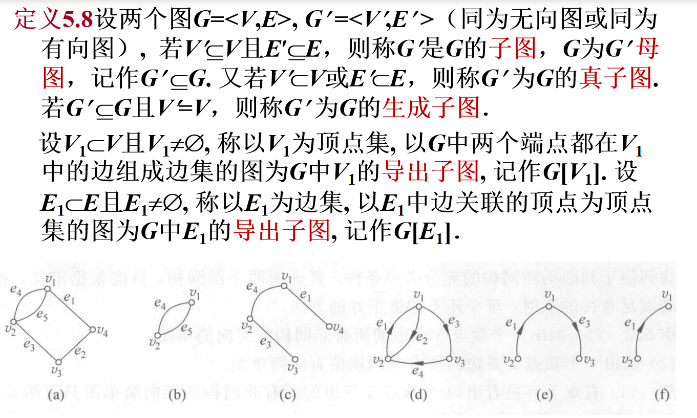
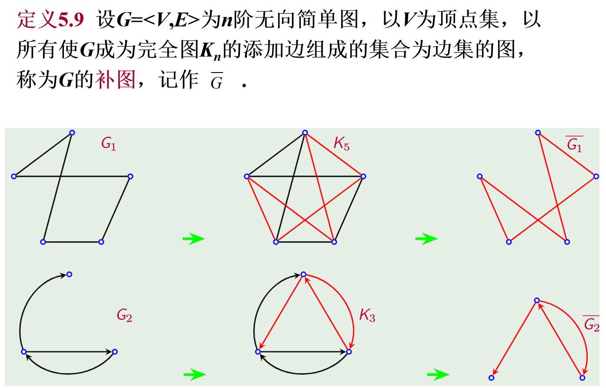
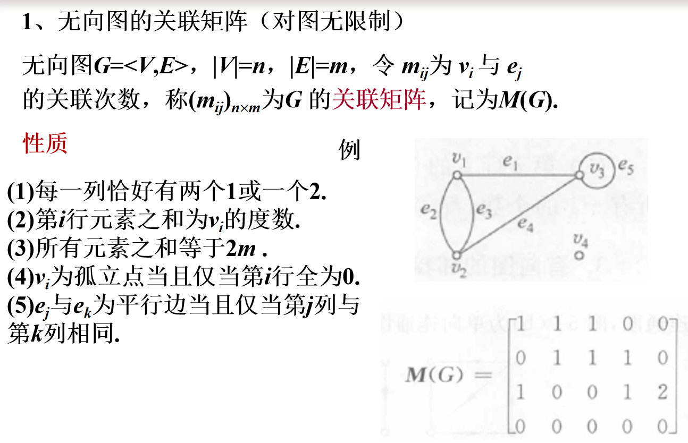
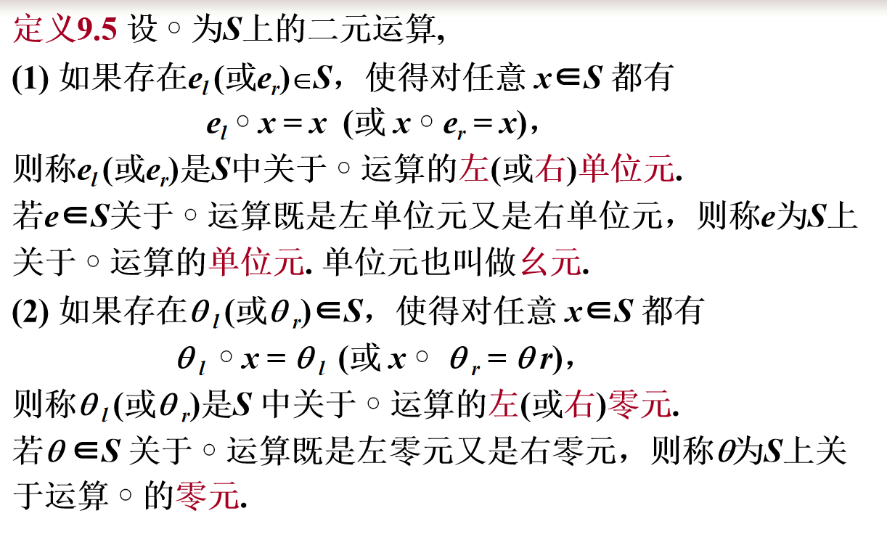
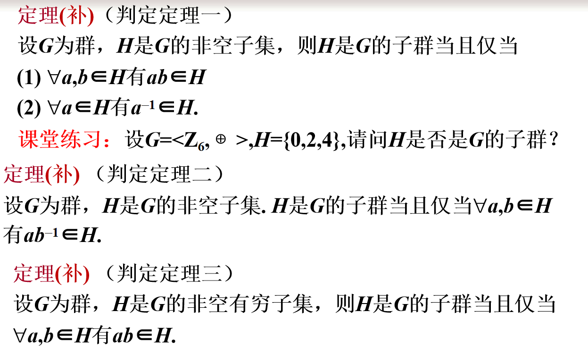

​															                                                                                        

# 离散复习

## 第一章——命题逻辑

### 1.如何判断是否为命题

1.是否为陈述句

2.是否具有唯一真值

举例：

（1）x+5>3  **不是命题，判断结果不唯一确定**

（2）明天下雪  **是命题，但真值现在不知道**

（3）我正在说假话  不是命题，陈述句中的悖论

注意：

感叹句、祈使句、疑问句都不是命题
陈述句中的悖论，判断结果不惟一确定的不是命题

### 2.联结词

否定 ┐     合取  ∧     析取  ∨   蕴涵 →   等价↔ 

#### 合取举例

（1）张辉与王丽都是三好生  **设p:张辉是三好生, q:王丽是三好生        p**∧**q**

（2）张辉与王丽是同学          **p:张辉与王丽是同学**

(1)—(2) 要求分清 “与” 所联结的成分

注意：
联结词是句子与句子之间的联结，而非单纯的名词、形容词、数词等地联结;
联结词是两个句子真值之间的联结，而非句子的具体含义的联结，两个句子之间可以无任何地内在联系;

#### 析取举例

(1) 令p:2是素数, q:4是素数,    **p∨q**

(2) 令p:小元元拿一个苹果, q:小元元拿一个梨   **(p∧ ┐q)∨ ( ┐p∧q)**
(3) p:王小红生于 1975 年, q:王小红生于1976 年   **(p∧ ┐q)∨ ( ┐p∧q)  或    p∨ q**

(1) 为相容或
(2)—(3) 为排斥或, 符号化时(3)可有两种形式，而(2)则不能
为什么(2)不能象(3)一样有两种表达式？**关键看与原题意是否相符，看两个命题是否能同时发生，（2）中的命题可以，而（3）中的命题不可以**

#### 蕴含

规定：p→q为假当且仅当p为真q为假.

(1)  p→q 的逻辑关系：q为 p 的**必要条件**
(2)  “如果 p, 则 q” 有很多不同的表述方法：
       因为p，所以q
        若p，就q
       只要p，就q
        p仅当q
       **只有q 才p**
       **除非q, 才p  或  除非q，否则非p，…．**
 (3) 当 p 为假时，p→q恒为真，称为空证明

#### 等价

规定：p↔ q为真当且仅当p与q同时为真或同时为假.

等价；**当且仅当**；充分必要

### 3.命题公式

#### 命题变项和合式公式

命题常项：简单命题，其真值是确定的

命题变项（命题变元）：取值1或0的变元

 合式公式：单个命题变项和命题常项是合式公式, 称作原子命题公式；若A, B是合式公式，┐A，A∧B，A∨B，A→B，A↔B也是

#### 合式公式层次 

例如   公式 A=p,  B= ┐p,  C= ┐p→q,  D= ┐(p→q)↔r, 
                    E=(( ┐p∧q) →r) ↔(┐r∨s)
           分别为0层，1层，2层，3层，4层公式.0 

#### 公式赋值与真值表

#### 公式的类型

(1) 若A在它的任何赋值下均为真, 则称A为重言式或永真式;
(2) 若A在它的任何赋值下均为假, 则称A为矛盾式或永假式;
(3) 若A不是矛盾式, 则称A是可满足式.

举例：

### 4.等值演算

#### 等值式

定义：若等价式A↔B是重言式，则称A与B等值，记作A⇔B，并称A⇔B是等值式

几点说明：
1.定义中，A, B, ⇔均为元语言符号，⇔不为联结词
2.A或B中可能有哑元出现
例如    (p→q)⇔((┐p∨q)∨(┐r∧r))     **r为左边公式的哑元.** 
3.用真值表可检查两个公式是否等值

#### 基本等值式

#### 证明两个公式等值

#### 判断公式类型

### 5.主析取范式和主合取范式

口诀：小 析 真

​			大 合 假

### 6.推理理论

#### 推理的形式结构

#### 判断推理是否正确的方法

#### 推理规则

#### 直接证明法

#### 附加前提证明法

#### 归谬法（反证法）

## 第二章——一阶逻辑

### 1.一阶逻辑命题符号化

#### 特性谓词加入命题函数的两个原则

对于全称量词（∀x），刻画其对应个体域的特性谓词作为**蕴含式**的前件加入。
对于存在量词（∃x），刻画其对应个体域的特性谓词作为**合取式**的合取项加入。

举例：

### 2.一阶逻辑合式公式

#### 指导变元和辖域

在公式 ∀xA 和 ∃xA 中，称x为指导变元，A为相应量词的辖域. 在∀x和 ∃x的辖域中，x的所有出现都称为约束出现，A中不是约束出现的其他变项均称为是自由出现的. 

举例：

#### 封闭的公式

若公式A中不含自由出现的个体变项，则称A为封闭的公式，简称闭式.

举例：

换名规则：

#### 公式的解释

略

## 第三章——集合

### 1.集合的基本概念

#### 集合与集合的关系

B包含于A：B是A的子集

A等于B

真子集

#### 空集是一切集合的子集

#### n元集和m元子集

#### 全集与幂集

### 2.集合的运算

#### 集合的基本运算

#### 集合算律

#### 集合等式证明

略

### 3.集合中的元素计数

## 第四章——二元关系与函数

### 1.集合的笛卡尔积与二元关系

#### 笛卡尔积

#### 二元关系

#### A到B的关系

#### A上的关系

举例：

### 2.关系的运算

#### 逆、合成、限制、像

#### 关系运算的性质

#### 关系的幂运算

#### 幂运算的性质

### 3.关系的性质

#### 自反和反自反

#### 对称与反对称

#### 传递性

#### 关系性质的证明

### 4.关系的闭包

#### 闭包定义

#### 构造闭包

### 5.等价关系与偏序关系

#### 等价关系

#### 等价类

#### 商集与划分

个人理解：把可以构成等价关系的子集归为一起

划分举例：

#### 偏序关系

#### 哈斯图

实例：

#### 偏序集中的特殊元素

都存在于B中

最小元<B<最大元，同一层不能有多个元素，否则则不存在。

极小元<=B<=极大元，同一层可以有多个元素，并且都是。

这个大小指的是有偏序关系的，集合之间的元素若不存在偏序关系则不存在。

举例：

#### 上界，下界，上确界，下确界

上界<=B<=下界

而且同一层不能有多个元素，否则则不存在。

上确界是上界中的最大的

下确界是下界中的最小的

不是大小关系，而是偏序关系

个人理解：上下界可以是B中的元素，但是必须与B中任意元素满足偏序关系，当然自己和自己一定满足偏序关系

### 6.函数

#### 函数的定义

#### 从A到B的函数

#### 函数的像

#### 函数的性质：单射、满射、双射

#### 举例：判断函数

#### 重要函数

#### 7.函数的复合和反函数

#### 复合函数定理

#### 复合函数的性质

#### 反函数的定义

## 第五章——图论

### 1.无向图及有向图

#### 图的相关概念

#### 顶点的度数

举例：

#### 握手定理

推论：

应用：

#### 图的度数列

#### 多重图和简单图

#### n阶完全图和竞赛图

举例：

#### 子图

#### 补图

#### 图的重构

### 2.通路、回路和图的连通性

#### 定义

环（长为1的圈）的长度为1

#### 无向图的连通性

#### 有向图的连通性

#### 图的连通性

个人理解：

点割集就是去掉这个集合中的点后，整个图不是连通图,且点割集是最小的集合，用最少的点就能把图割了。

而当一个点割集中只有一个元素时，整个元素就是割点。

边割集和桥同上理解。

### 3.图的矩阵表示

#### 无向图的关联矩阵

行是顶点，列是边，之间有关联就为1。

#### 有向图的关联矩阵

#### 有向图的邻接矩阵

一行一行看，一行表示一个顶点，该顶点作为始点与其他顶点相连的边数

#### 邻接矩阵的应用

#### 有向图的可达矩阵

## 第六章——三个图

### 1.二部图

#### 判别

只有最右边那个图不是二部图

#### 匹配

极大匹配：再加一条边，就不能满足任意两边不相邻

最大匹配：边数最多

完美匹配：图中每个顶点都是匹配中边的端点

#### 二部图中的匹配

#### Hall定理

### 2.欧拉图

#### 定义

#### 实例

#### 无向图判别

#### 有向图判别

### 3.哈密顿图

#### 定义

#### 实例

#### 必要条件

#### 充分条件

#### 判断

## 第九章——二元运算及代数系统

### 1.二元运算及其性质

#### 定义

非零实数集中，有理数加减无理数构成虚数，不属于实数。

#### 运算表

#### 性质

#### 通过运算表判断运算性质

结合律的判断方法无法直接从运算表上判断，只有根据定义计算出每个结果来判断。

#### 特异元素

单位元理解为1，任何数*1都为本身

零元理解为0，0*任何数都为0.

#### 由运算表判断特意元素

幺元

零元

#### 逆元

举例：

#### 惟一性定理

长话短说：如果各种元存在，在二元运算中，幺元和零元是惟一的；在可结合的二元运算中，逆元是惟一的。

### 2.几个典型的代数系统

#### 半群和独异点

#### 群

群：可结合（半群），有幺元，有逆元

实例：

#### 有关群的术语

关于x^-1^的运算：求的是x的逆元

#### 群的性质

幂运算规则

方程存在惟一解

消去律

运算表排列规则

元素的阶

#### 子群定义

#### 子群判定定理

#### 中心、陪集的定义

ha表示h与a做二元运算

#### 陪集的基本性质

#### 左陪集的定义与性质

#### Lagrange定理

#### 循环群

举例：

#### 循环群的生成元

举例：

#### 循环群的子群

举例；

正因子d为代表d阶，n/d是生成元，<n/d>

举例：

#### 格的定义

什么鬼定义和例子，应该不是重点

举例：

#### 格的性质

对偶原理

（太高级啦）

算律

保序

#### 格作为代数系统的定义

#### 分配格

#### 分配格的判别及性质

#### 有界格的定义

#### 补元的定义

实例：

由实例看：最低和最高的元素互补，中间的元素是与  等高的元素以及相邻的上下元素  互补（除去最低和最高的元素）。

#### 有补格的定义

#### 布尔代数的定义

#### 布尔代数的性质

#### 布尔代数作为代数系统的定义

